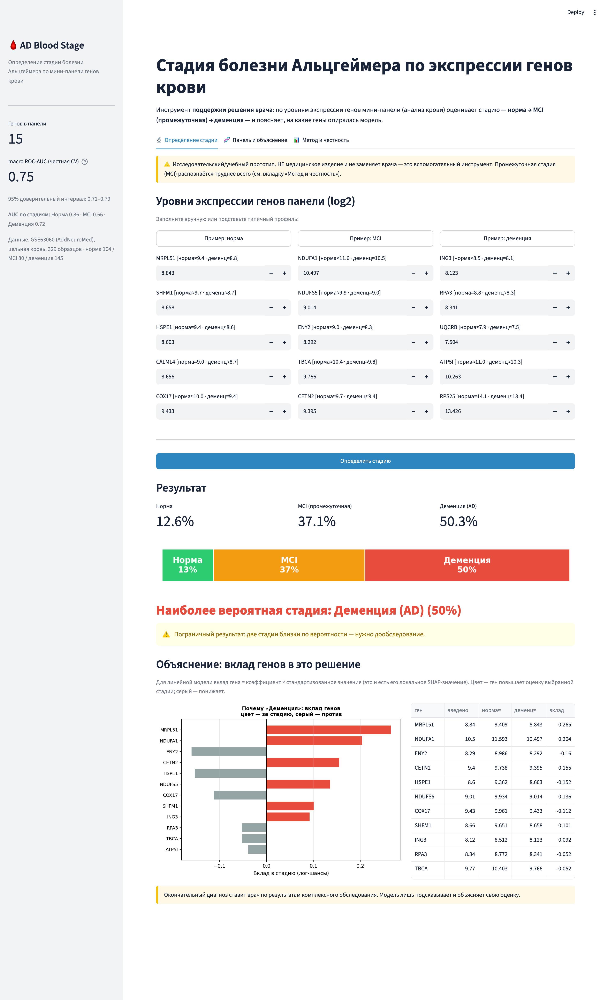
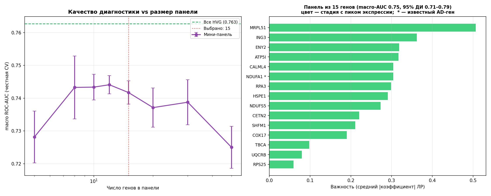
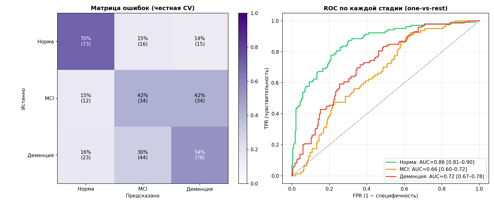

# AD Blood Stage — ранняя стадийная диагностика болезни Альцгеймера по крови

Курсовой проект по биоинформатике. Веб-инструмент поддержки решения врача, который по **экспрессии генов в крови** определяет **стадию** болезни Альцгеймера — **норма → MCI (промежуточная) → деменция** — и **объясняет**, на какие гены опиралась модель.

> **Новизна (коротко):** интерпретируемый веб-прототип стадийной диагностики болезни Альцгеймера по минимальной панели генов крови с по-классовой валидацией без утечки и персональным SHAP-объяснением; не претендует на клиническую сертификацию.



---

## 1. Проблема и зачем это нужно

Болезнь Альцгеймера поражает **55+ млн человек** (ВОЗ). Ключевая беда — **позднее установление диагноза**: патология (амилоидные бляшки, тау-клубки) развивается **за 10–20 лет до первых симптомов**, и к моменту клинического диагноза уже необратимо потеряна значительная часть нейронов гиппокампа и коры (Jack et al., 2018). Одобренные препараты (леканемаб, донанемаб) работают **только на ранней стадии** — поэтому критично поймать болезнь в окне **MCI (умеренные когнитивные нарушения)**, пока она ещё обратима.

**Промежуточная стадия (MCI) — это и есть терапевтическое окно.** Цель проекта — выявлять её по доступному анализу: не по биопсии мозга (её у живого пациента не взять), а по **крови**.

## 2. Обоснование разработки и новизна

Большинство известных решений делают одно из двух, но не всё сразу:

| Проект | Тип данных | Бинарно / **3 стадии** | Интерпретация | Развёрнутый сайт | Доступ к данным |
|---|---|---|---|---|---|
| **AD Blood Stage (наш)** | **гены крови** | **3 стадии** | **SHAP (глобально + персонально)** | **да (Streamlit)** | **открытые (GEO)** |
| c-Triadem (2024) | гены + генотип | 3 стадии | SHAP | нет | закрытый ADNI |
| AD Progression (Streamlit) | клин. шкалы | 3 стадии | LIME+SHAP | да | клинические |
| AITeQ (2024) | гены (RNA-seq) | бинарно | отбор признаков | нет | открытые |
| LightGBM tool (2025) | рутинная клиника | бинарно | важность | да | NACC |
| MRI-Alzheimers-CNN | МРТ-снимки | 3 стадии | нет | нет | ADNI |
| DeepAttentionADNet | МРТ-снимки | 3 стадии | частично | нет | ADNI |
| AD-DL (ARAMIS) | МРТ/PET | 3 стадии | нет | нет | ADNI/OASIS |
| arpy8 (Streamlit) | клиника+APOE | бинарно | нет | да | открытые |
| Explainable Ensemble | клин. таблица | бинарно | SHAP | да | открытые |

**Незанятая ниша = наша новизна:** соединить в одном инструменте всё сразу — *гены крови + 3 стадии + минимальная панель + интерпретируемость + развёрнутый сайт + валидация без утечки на открытых данных*. По отдельности это есть у разных проектов, вместе — нет.

Сильная сторона — **прозрачность**: мы приводим метрики по каждой стадии и прямо показываем, что MCI распознаётся труднее всего, а не прячем это за общим числом.

## 3. Реферат (функционал и ожидаемый результат)

- **Вход:** уровни экспрессии 15 генов панели (из анализа крови — qPCR/микрочип).
- **Выход:** вероятности трёх стадий (норма / MCI / деменция), предсказанная стадия и **персональное объяснение** — вклад каждого гена в решение (локальные SHAP-значения).
- **Для кого:** инструмент поддержки решения врача (скрининг, не окончательный диагноз).
- **Ожидаемый результат:** `macro ROC-AUC ≈ 0.75` (кросс-валидация); уверенное отделение нормы от болезни (AUC 0.86), MCI — труднее (AUC 0.66).

## 4. Данные

**GSE63060** (когорта **AddNeuroMed**) — открытый датасет с NCBI GEO, **без заявок и разрешений**, доступен из РФ:

- **329 образцов цельной крови:** норма (CTL) **104** · MCI **80** · деменция (AD) **145**;
- платформа Illumina HumanHT-12 v3 (микрочип); после сведе́ния зондов в гены — **17 654 гена**;
- скачивание + сборка одной командой: `python cli.py download`.

Почему кровь, а не мозг: предыдущая версия проекта работала с scRNA-seq мозга (GSE138852), но там, во-первых, **только 2 класса** (норма/AD — без промежуточной стадии), а во-вторых, биопсию мозга **нельзя** взять у живого пациента. Кровь решает обе проблемы.

## 5. Функциональная схема

```
GSE63060 (кровь, микрочип)
   │  download_data.py — скачивание series matrix + аннотации GPL6947
   ▼
data_loader.py — probe→ген (GPL6947), метки стадий CTL/MCI/AD
   │  preprocessor.py — log2, нормализация, фильтр генов
   ▼
biomarker_panel.py ── ОТБОР ПАНЕЛИ + МОДЕЛЬ (новизна) ───────────────┐
   │  предфильтр HVG (без меток) → ANOVA-отбор ВНУТРИ фолдов CV       │
   │  мультиномиальная логистическая регрессия (норма<MCI<деменция)  │
   │  стратифицированная CV без утечки + бутстрэп 95% ДИ              │
   ▼                                                                  ▼
results/panel_model.pkl                          графики: качество vs размер,
   │                                              матрица ошибок, ROC, SHAP
   ▼
app.py (Streamlit) — ввод генов → 3 вероятности + персональный SHAP + дисклеймер
```

## 6. Результаты

Стратифицированная кросс-валидация без утечки (отбор генов и масштабирование — **строго внутри обучающих фолдов**):

| Метрика | Значение (95% ДИ) |
|---|---|
| macro ROC-AUC | **0.75** (0.71–0.79) |
| AUC — Норма | 0.86 (0.81–0.90) |
| AUC — MCI (промежуточная) | 0.66 (0.60–0.72) |
| AUC — Деменция | 0.72 (0.67–0.78) |
| macro-F1 / balanced acc | 0.54 / 0.55 |

**Контроль утечки:** «наивный» отбор генов на всех данных даёт macro-AUC 0.74 ≈ 0.75 → **переобучения/утечки нет**.




**Биология панели.** Почти все 15 генов — митохондриальные и рибосомальные (NDUFA1, NDUFS5, UQCRB, ATP5I, COX17, MRPL51, HSPE1, RPS25 …), и все **снижаются** от нормы к деменции. Это согласуется с известным сигналом **снижения окислительного фосфорилирования и синтеза белка в крови при AD** (Lunnon et al., 2013) — независимая биологическая валидация панели.

## 7. Запуск

```bash
python3 -m venv venv && source venv/bin/activate
pip install -r requirements.txt

python cli.py download    # GSE63060 с NCBI GEO (~70 МБ)
python cli.py panel       # отбор панели + обучение 3-классовой модели
streamlit run app.py      # веб-интерфейс
```

## 8. Структура проекта

```
ad-blood-stage/
├── cli.py              — точка входа: download / panel / report
├── config.py           — параметры: датасет, классы, размер панели
├── download_data.py    — загрузка GSE63060 (series matrix + GPL6947)
├── data_loader.py      — парсинг, probe→ген, метки стадий
├── preprocessor.py     — log2 / нормализация / фильтр
├── biomarker_panel.py  — ★ отбор панели + 3-классовая модель + CV без утечки + SHAP
├── app.py              — Streamlit: интерфейс + персональный SHAP
├── build_presentation.py — сборка .pptx
├── make_docs.py        — сборка литературного обзора (.docx)
├── results/            — модель (pkl) и графики; часть закоммичена для деплоя (Streamlit Cloud)
└── docs/               — README-графики, доклад, описание проекта, литобзор, DEPLOY
```

## 9. Ограничения

- **MCI — трудный класс** (AUC ~0.66): это объективно так и в литературе (~0.55–0.80); модель часто путает MCI с соседними стадиями. Практическая ценность — скрининг «норма vs болезнь» (AUC 0.86): «кровь выглядит ненормально → направить на дообследование».
- **Терминология:** три класса неравноправны по статусу диагноза — норма (здоровые), деменция (клинически диагностирована), а вот MCI строго говоря не «стадия болезни Альцгеймера», а более широкий синдром с подозрением на возможную раннюю AD (диагноз в датасете основан на клинических/нейропсихологических критериях, а не на подтверждении амилоида/тау). «Стадия» в тексте проекта используется в широком, а не строго нозологическом смысле.
- Данные — **одна когорта**; для клиники нужна **внешняя валидация** (например, GSE63061) и проспективное исследование.
- Это **исследовательский прототип поддержки решения**, **не** сертифицированный диагностический тест.
- Возможные риски: переобучение (снято отбором внутри фолдов), дисбаланс классов (снят `class_weight=balanced` и стратификацией), утечки персональных данных нет — модель работает с обезличенными уровнями экспрессии.

## 10. Источники

- Sood S. et al. (2015). A novel multi-tissue RNA diagnostic of healthy ageing relates to cognitive health status. *Genome Biology*, 16, 185. — когорта AddNeuroMed, датасеты **GSE63060/GSE63061**.
- Lunnon K. et al. (2013). A blood gene expression marker of early Alzheimer's disease. *J Alzheimers Dis*, 33(3), 737–753. — митохондриальная сигнатура в крови при AD.
- Jack C.R. et al. (2018). NIA-AA Research Framework. *Alzheimers Dement*, 14(4), 535–562. — стадии и сроки нейродегенерации.
- Varoquaux G. (2018). Cross-validation failure: small sample sizes lead to large error bars. *NeuroImage*, 180, 68–77. — почему важны доверительные интервалы и корректная кросс-валидация.
- Lundberg S. & Lee S. (2017). A Unified Approach to Interpreting Model Predictions (**SHAP**). *NeurIPS*.
- Benjamini Y. & Hochberg Y. (1995). Controlling the false discovery rate. *J R Stat Soc B*, 57(1), 289–300.
- Сравнение аналогов: c-Triadem (PMC11996220), AITeQ (*Brief Bioinform* 2024), Web App for AD Prediction & Progression (PMC11710638), AD-DL (github.com/aramis-lab/AD-DL).

> Предыдущая ветка (scRNA-seq мозга GSE138852, бинарная классификация) вынесена в локальную папку `legacy/` — она мотивировала переход к развёртываемому анализу по крови.
