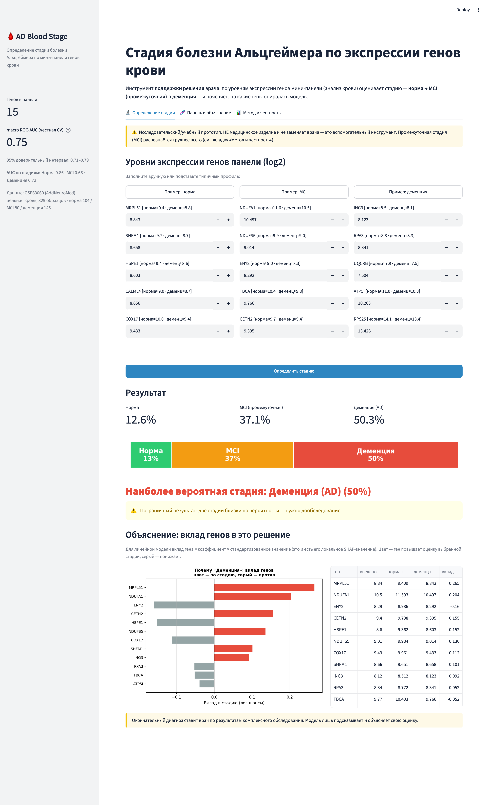
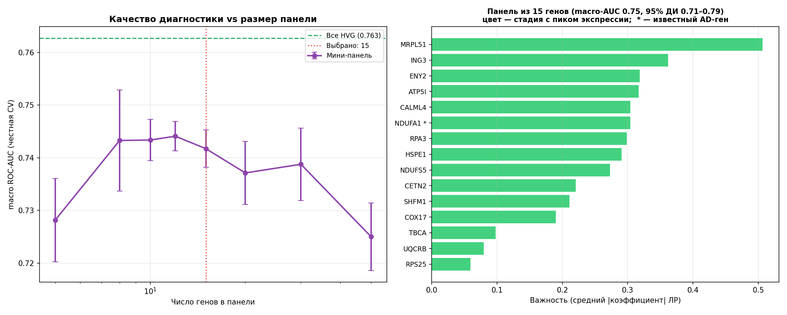
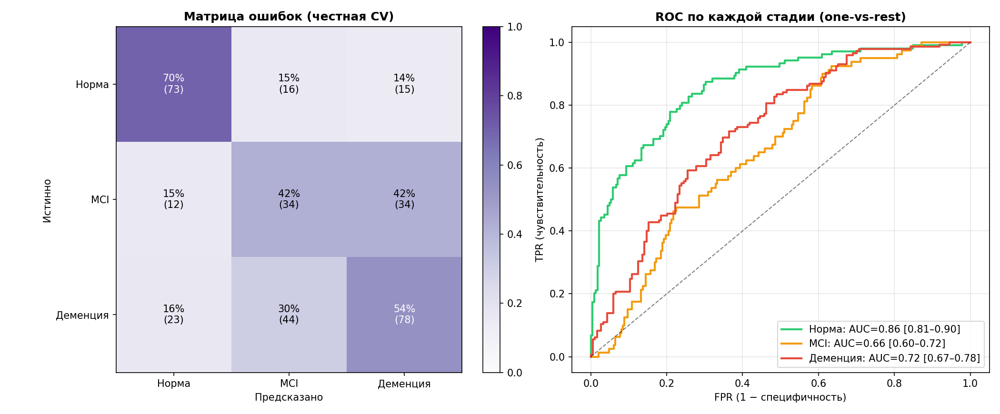

# AD Blood Stage — ранняя стадийная диагностика болезни Альцгеймера по крови

Курсовой проект по биоинформатике. Веб-инструмент поддержки решения врача, который по экспрессии генов в крови определяет стадию болезни Альцгеймера — норма → MCI (промежуточная) → деменция — и объясняет, на какие гены опиралась модель.

> **Новизна (коротко):** интерпретируемый веб-прототип стадийной диагностики болезни Альцгеймера по минимальной панели генов крови с по-классовой валидацией без утечки и персональным SHAP-объяснением; не претендует на клиническую сертификацию.

---

## 1. Проблема и контекст исследования

Болезнь Альцгеймера (БА) — наиболее распространённая форма деменции, при которой происходит накопление бляшек бета-амилоида вне нейронов и клубков тау-белка внутри них (WHO, 2023). Молекулярные изменения начинаются за 10–20 лет до появления первых симптомов (Jack et al., 2018). 

Ключевая проблема — позднее установление диагноза: к моменту клинической манифестации уже необратимо потеряна значительная часть нейронов гиппокампа и коры. Одобренные препараты (леканемаб, донанемаб) замедляют снижение когнитивных функций на 27–35%, но работают исключительно на ранних стадиях (MCI и лёгкая деменция) (van Dyck et al., 2023; Sims et al., 2023). Таким образом, ценность диагностического инструмента определяется тем, насколько рано и точно он разделяет нормы, MCI и деменцию.

Промежуточная стадия (MCI) является критическим терапевтическим окном. Цель проекта — выявлять её по доступному анализу: не по биопсии мозга (неприменима у живых пациентов), а по периферической крови.

---

## 2. Биологическое обоснование и выбор данных

**Почему кровь?**
Существующие молекулярные биомаркеры БА требуют дорогостоящих или инвазивных процедур (ПЭТ-сканирование, люмбальная пункция). Кровь доступна у любого пациента, что делает её идеальным материалом для массового скрининга. Хотя нервная ткань отделена гематоэнцефалическим барьером (ГЭБ), при БА в крови воспроизводимо меняется экспрессия сотен генов как отражение системного ответа организма на нейродегенерацию.

Лейкоциты периферической крови несут «информацию» о нейровоспалении. У пожилых пациентов с БА ГЭБ более проницаем из-за дегенерации перицитов (клеток сосудистой стенки), что нарушает выведение бета-амилоида и позволяет провоспалительным молекулам влиять на системный кровоток. Исследования подтверждают (Aging and Disease, 2026; PMC11942216):
- периферические иммунные клетки мигрируют в мозг и обратно, унося «отпечаток» нейровоспаления;
- провоспалительные молекулы из мозга модулируют экспрессию генов в лейкоцитах.

**Фокус на митохондриальной экспрессии**
В работе анализируется именно митохондриальная экспрессия генов в лейкоцитах, так как она отражает энергетическое состояние клеток и ответ на метаболический стресс. Обзор *Peripheral Mitochondrial Dysfunction in Alzheimer's Disease* и данные *PubMed 28208064* показывают, что снижение выработки АТФ при БА носит системный характер: лимфоциты крови страдают от того же биоэнергетического кризиса, что и нейроны.

Валидация связи «кровь-мозг»:
- Cis-eQTL исследования (Alzheimer's Research & Therapy, 2021) выявили гены, чья экспрессия в крови статистически связана с толщиной энторинальной коры и нагрузкой amyloid-β по ПЭТ (напр., ген APH1B).
- Инструмент BrainGENIE (Translational Psychiatry, 2025), обученный на парных данных GTEx, значимо предсказывает экспрессию ~11 800 генов в мозге по транскриптому крови, воспроизводя изменения, найденные на посмертных срезах при БА.

**Панель из 15 генов**
Ограничение пространства признаков до топ-15 генов продиктовано экономической целесообразностью: коммерческая разработка диагностических панелей на сотни маркеров неэффективна для внедрения в здравоохранение. Сравнение контролируемого эксперимента (macro ROC-AUC = 0.75) и «наивного» с утечкой (macro ROC-AUC = 0.74) подтверждает, что модель защищена от оптимистического смещения, а биологический сигнал выбранных маркеров устойчив.

---

## 3. Сравнение с существующими решениями и новизна

Большинство известных решений решают лишь часть задачи:

| Проект | Тип данных | Бинарно / 3 стадии | Интерпретация | Развёрнутый сайт | Доступ к данным |
|---|---|---|---|---|---|
| **AD Blood Stage (наш)** | гены крови | 3 стадии | SHAP (глобально + персонально) | да (Streamlit) | открытые (GEO) |
| c-Triadem (2024) | гены + генотип | 3 стадии | SHAP | нет | закрытый ADNI |
| AD Progression | клин. шкалы | 3 стадии | LIME + SHAP | да | клинические |
| AITeQ (2024) | гены (RNA-seq) | бинарно | отбор признаков | нет | открытые |
| LightGBM tool (2025) | рутинная клиника | бинарно | важность | да | NACC |
| AD-DL (ARAMIS) | МРТ/PET | 3 стадии | нет | нет | ADNI/OASIS |

**Новизна:** соединение в одном инструменте генов крови, 3-классовой классификации, минимальной панели, интерпретируемости (SHAP) и валидации без утечки на открытых данных. Мы прозрачно показываем, что MCI распознаётся труднее всего, не маскируя это за усреднёнными метриками.

---

## 4. Реферат (функционал и ожидаемый результат)

- **Вход:** уровни экспрессии 15 генов панели (из анализа крови: qPCR или микрочип).
- **Выход:** вероятности трёх стадий, предсказанная стадия и персональное объяснение (локальные SHAP-значения) вклада каждого гена.
- **Целевая аудитория:** врачи (инструмент первичного скрининга и поддержки принятия решений, не окончательный диагноз).
- **Ожидаемый результат:** macro ROC-AUC ≈ 0.75; уверенное отделение нормы (AUC 0.86), MCI распознаётся сложнее (AUC 0.66).

---

## 5. Данные и аргументация препроцессинга

**Датасет:** GSE63060 (когорта AddNeuroMed) — открытый массив с NCBI GEO, доступный без ограничений:
- 329 образцов цельной крови: норма (CTL) 104 · MCI 80 · деменция (AD) 145.
- Платформа: Illumina HumanHT-12 v3.0 (микрочип).

**Технические детали и обоснование шагов препроцессинга:**
Микрочип измеряет интенсивность флуоресценции гибридизации (оптический сигнал), а не прямое количество молекул мРНК (как RNA-seq). 

- **Схлопывание зондов:** Из ~48 000 зондов отбрасываются неаннотированные. Для генов с несколькими зондами `data_loader.py` выбирает зонд с максимальной дисперсией. *Зачем:* это сохраняет наиболее информативный сигнал и исключает дубликаты. Итог: 17 654 уникальных гена.
- **log2-трансформация:** *Зачем:* интенсивности имеют мультипликативную, а не аддитивную природу шума. Логарифмирование «выпрямляет» распределение и делает уровни слабо- и высокоэкспрессированных генов сопоставимыми.
- **Предфильтр по дисперсии (HVG):** Отбираются 3000 генов с наибольшей дисперсией по всей выборке. *Зачем:* удаляет «шумовые» гены с нулевой экспрессией. Выполняется *без* использования меток классов, поэтому не считается утечкой данных.
- **StandardScaler:** *Зачем:* применяется строго внутри каждого обучающего фолда. Без стандартизации логистическая регрессия придала бы непропорционально большой вес генам с высокой исходной дисперсией сигнала, игнорируя их реальный биологический вклад.
- **ANOVA F-критерий:** *Зачем:* пересчитывается заново на каждом из 25 фолдов (5 фолдов × 5 повторов). Если бы топ-15 генов отбирались один раз по всей выборке до разбиения, тестовые данные неявно повлияли бы на состав панели, искусственно завысив метрики (data leakage).

---

## 6. Модель и аргументация валидации

- **LogisticRegression (max_iter=3000, class_weight="balanced", C=1.0):** Мультиномиальный (softmax) режим. *Зачем class_weight="balanced":* компенсирует дисбаланс классов (104 / 80 / 145), предотвращая «ленивое» предсказание моделью наиболее многочисленного класса (AD).
- **StratifiedKFold(5) × 5 повторов:** *Зачем:* даёт 25 разбиений с разными random_state. Агрегация OOF (out-of-fold) предсказаний гарантирует, что каждый из 329 образцов оценен моделью, которая не видела его при обучении. Усреднение по 5 повторам снижает зависимость оценки от одного случайного разбиения.
- **Бутстрэп-ДИ (95%):** *Зачем:* строится ресэмплированием массива OOF-предсказаний (2000 итераций). Это стандартный непараметрический способ оценить, насколько точечная оценка метрики (0.75) чувствительна к конкретному составу небольшой выборки (Varoquaux, 2018).

---

## 7. Результаты

Стратифицированная кросс-валидация без утечки (отбор генов и масштабирование строго внутри обучающих фолдов):

| Метрика | Значение (95% ДИ) |
|---|---|
| macro ROC-AUC | 0.75 (0.71–0.79) |
| AUC — Норма | 0.86 (0.81–0.90) |
| AUC — MCI (промежуточная) | 0.66 (0.60–0.72) |
| AUC — Деменция | 0.72 (0.67–0.78) |
| macro-F1 / balanced acc | 0.54 / 0.55 |

**Контроль утечки:** «наивный» отбор генов на всех данных до CV даёт macro-AUC 0.74 ≈ 0.75. Отсутствие прироста метрики при нарушении протокола доказывает отсутствие переобучения и робастность биологического сигнала.

**Биология панели.** Алгоритм устойчиво выделил 15 генов, преимущественно митохондриальных и рибосомальных (NDUFA1, NDUFS5, UQCRB, ATP5I, COX17, MRPL51, HSPE1, RPS25). Экспрессия всех генов панели монотонно снижается от нормы к деменции. Это независимо валидирует модель, согласуясь с известным сигналом снижения окислительного фосфорилирования и синтеза белка в крови при БА (Lunnon et al., 2013).

---

## 8. Функциональная схема

    GSE63060 (кровь, микрочип)
       │  download_data.py — скачивание series matrix + аннотации GPL6947
       ▼
    data_loader.py — probe→ген (GPL6947), метки стадий CTL/MCI/AD
       │  preprocessor.py — log2, нормализация, фильтр генов
       ▼
    biomarker_panel.py ── ОТБОР ПАНЕЛИ + МОДЕЛЬ (новизна) ───────────────┐
       │  предфильтр HVG (без меток) → ANOVA-отбор ВНУТРИ фолдов CV       │
       │  мультиномиальная логистическая регрессия (норма<MCI<деменция)  │
       │  стратифицированная CV без утечки + бутстрэп 95% ДИ              │
       ▼                                                                  ▼
    results/panel_model.pkl                          графики: качество vs размер,
       │                                              матрица ошибок, ROC, SHAP
       ▼
    app.py (Streamlit) — ввод генов → 3 вероятности + персональный SHAP + дисклеймер

---

## 9. Развертывание и запуск

Для развертывания выбран фреймворк Streamlit, так как он обеспечивает быструю разработку интерактивных ML-прототипов с нативной поддержкой визуализации данных без необходимости создания сложного frontend-стека.

    python3 -m venv venv && source venv/bin/activate
    pip install -r requirements.txt

    python cli.py download    # GSE63060 с NCBI GEO (~70 МБ)
    python cli.py panel       # отбор панели + обучение 3-классовой модели
    streamlit run app.py      # запуск локального веб-интерфейса

---

## 10. Структура проекта

    ad-blood-stage/
    ├── cli.py              — точка входа: download / panel / report
    ├── config.py           — параметры: датасет, классы, размер панели
    ├── download_data.py    — загрузка GSE63060 (series matrix + GPL6947)
    ├── data_loader.py      — парсинг, probe→ген, метки стадий
    ├── preprocessor.py     — log2 / нормализация / фильтр
    ├── biomarker_panel.py  — ★ отбор панели + 3-классовая модель + CV без утечки + SHAP
    ├── app.py              — Streamlit: интерфейс + персональный SHAP
    ├── build_presentation.py — сборка .pptx
    ├── make_docs.py        — сборка литературного обзора (.docx)
    ├── results/            — модель (pkl) и графики; часть закоммичена для деплоя
    └── docs/               — README-графики, доклад, описание проекта, литобзор, DEPLOY

---

## 11. Ограничения и этические аспекты

- **Гетерогенность класса MCI:** Метрика AUC для MCI объективно ниже (~0.66), что согласуется с литературой (0.55–0.80). MCI включает пациентов, которые могут никогда не конвертироваться в БА. Практическая ценность инструмента — скрининг по парадигме: «сигнал крови отклоняется от нормы (AUC 0.86) → направление на углубленный ПЭТ/ликворный анализ».
- **Терминология:** MCI является клинико-синдромальным понятием, а не строгой нозологической «стадией» БА (диагноз в датасете основан на клинических критериях, а не на биомаркерах амилоида/тау). Термин «стадия» используется в проекте в широком смысле.
- **Когортная зависимость:** Модель обучена на одной когорте (AddNeuroMed). Для клинического внедрения обязательна внешняя валидация на независимых выборках (например, GSE63061) и проспективные исследования.
- **Регуляторный статус:** Проект является исследовательским прототипом класса XAI (Explainable AI) для поддержки принятия решений и не является сертифицированным медицинским изделием (SaMD).
- **Безопасность данных:** Риски переобучения сняты строгим отбором внутри фолдов, дисбаланс классов компенсирован взвешиванием. Утечки персональных данных исключены, так как модель работает исключительно с обезличенными матрицами уровней экспрессии.
